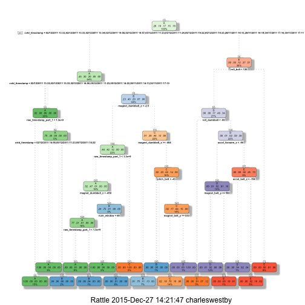

#Synopsis
In this report we will be using data from the accelerometers on the belt, forearm, arm, and dumbell of 6 participants. These participants were asked to perform barbell lifts both correctly and incorrectly in 5 different ways. This data was used to create training and test sets. These training and test sets will be used to predict whether the exercise was done correctly or incorrectly. Whether the exercise was done correctly or incorrectly is represented by the variable "classe" in the training set. We will build multiple prediction models and use cross-validation. We will use the best model and try to predict 20 different test cases.

# Processing Data

### Loading Libraries and Data ###

```r
setwd("~/GitHub/Machine-Learning")
library(caret); library(caretEnsemble); library(AppliedPredictiveModeling); library(ggplot2); library(dplyr); library(rpart); library(rattle); library(rpart.plot); library(knitr); library(ElemStatLearn); library(randomForest); library(lattice)

if (!file.exists("pml-training.csv")) {
    fileURL   <-  'https://d396qusza40orc.cloudfront.net/predmachlearn/pml-training.csv'
    download.file(fileURL, destfile="pml-training.csv", method = "curl")
}
training_data <-  read.csv("pml-training.csv", na.strings = c("NA","#DIV/0!", ""), header=TRUE)

if (!file.exists("pml-testing.csv")) {
    fileURL   <-  'https://d396qusza40orc.cloudfront.net/predmachlearn/pml-testing.csv'
    download.file(fileURL, destfile="pml-testing.csv", method = "curl")
}
testing_data  <-  read.csv("pml-testing.csv", na.strings = c("NA","#DIV/0!", ""), header=TRUE)

inTrain       <- createDataPartition(y=training_data$classe, p=0.6, list=FALSE)
training      <- training_data[inTrain, ]
testing       <- training_data[-inTrain, ]
dim(training); dim(testing)
```

```
## [1] 11776   160
```

```
## [1] 7846  160
```


## Cleaning Data

```r
nzv           <- nearZeroVar(training, saveMetrics=TRUE)
training      <- training[,nzv$nzv==FALSE]

nzv           <- nearZeroVar(testing,saveMetrics=TRUE)
testing       <- testing[,nzv$nzv==FALSE]

training      <- training[c(-1)]

trainingV3    <- training
for(i in 1:length(training)) {
    if( sum( is.na( training[, i] ) ) /nrow(training) >= .7) {
        for(j in 1:length(trainingV3)) {
            if( length( grep(names(training[i]), names(trainingV3)[j]) ) == 1)  {
                trainingV3 <- trainingV3[ , -j]
            }   
        } 
    }
}


training        <- trainingV3
rm(trainingV3)

clean1          <- colnames(training)
clean2          <- colnames(training[, -58])  
testing         <- testing[clean1]         
testing_data    <- testing_data[clean2]            

dim(testing)
```

```
## [1] 7846   58
```

```r
dim(testing_data)
```

```
## [1] 20 57
```
##  Predictive Models

### Classification Tree Model

```r
set.seed(828)
modFitCT          <- rpart(classe ~ ., data=training, method="class")
fancyRpartPlot(modFitCT)
```

 

```r
predictionsCT     <- predict(modFitCT, testing, type = "class")
confusionMatrix(predictionsCT, testing$classe)
```

```
## Confusion Matrix and Statistics
## 
##           Reference
## Prediction    A    B    C    D    E
##          A 2144   60    6    3    0
##          B   66 1271   81   48    0
##          C   22  176 1242  138   52
##          D    0   11   25  935   74
##          E    0    0   14  162 1316
## 
## Overall Statistics
##                                           
##                Accuracy : 0.8804          
##                  95% CI : (0.8731, 0.8875)
##     No Information Rate : 0.2845          
##     P-Value [Acc > NIR] : < 2.2e-16       
##                                           
##                   Kappa : 0.8488          
##  Mcnemar's Test P-Value : NA              
## 
## Statistics by Class:
## 
##                      Class: A Class: B Class: C Class: D Class: E
## Sensitivity            0.9606   0.8373   0.9079   0.7271   0.9126
## Specificity            0.9877   0.9692   0.9401   0.9832   0.9725
## Pos Pred Value         0.9688   0.8670   0.7620   0.8947   0.8820
## Neg Pred Value         0.9844   0.9613   0.9797   0.9484   0.9802
## Prevalence             0.2845   0.1935   0.1744   0.1639   0.1838
## Detection Rate         0.2733   0.1620   0.1583   0.1192   0.1677
## Detection Prevalence   0.2821   0.1868   0.2077   0.1332   0.1902
## Balanced Accuracy      0.9741   0.9032   0.9240   0.8551   0.9426
```

### Random Forest Model

```r
set.seed(828)
modFitRF          <- randomForest(classe ~ ., data=training)
predictionsRF     <- predict(modFitRF, testing, type= "class")
confusionMatrix(predictionsRF, testing$classe)
```

```
## Confusion Matrix and Statistics
## 
##           Reference
## Prediction    A    B    C    D    E
##          A 2232    0    0    0    0
##          B    0 1518    0    0    0
##          C    0    0 1368    1    0
##          D    0    0    0 1283    3
##          E    0    0    0    2 1439
## 
## Overall Statistics
##                                           
##                Accuracy : 0.9992          
##                  95% CI : (0.9983, 0.9997)
##     No Information Rate : 0.2845          
##     P-Value [Acc > NIR] : < 2.2e-16       
##                                           
##                   Kappa : 0.999           
##  Mcnemar's Test P-Value : NA              
## 
## Statistics by Class:
## 
##                      Class: A Class: B Class: C Class: D Class: E
## Sensitivity            1.0000   1.0000   1.0000   0.9977   0.9979
## Specificity            1.0000   1.0000   0.9998   0.9995   0.9997
## Pos Pred Value         1.0000   1.0000   0.9993   0.9977   0.9986
## Neg Pred Value         1.0000   1.0000   1.0000   0.9995   0.9995
## Prevalence             0.2845   0.1935   0.1744   0.1639   0.1838
## Detection Rate         0.2845   0.1935   0.1744   0.1635   0.1834
## Detection Prevalence   0.2845   0.1935   0.1745   0.1639   0.1837
## Balanced Accuracy      1.0000   1.0000   0.9999   0.9986   0.9988
```


```r
predictionRF2     <- predict(modFitRF, testing, type = "class")

pml_write_files = function(x){
    n = length(x)
    for(i in 1:n){
        filename = paste0("problem_id_",i,".txt")
        write.table(x[i],file=filename,quote=FALSE,row.names=FALSE,col.names=FALSE)
    }
}
```

# Conclusion

- Accuracy from the Classification Tree model was 86.9%. Therefore, the out of sample error rate for this model should be about 13.1%.
- Accuracy from the Random Forest model was 99.9%. Therefore, the out of sample error rate for this model should be about 0.1%
- In the end, we use the Random Forest model because it is the better predictor.

